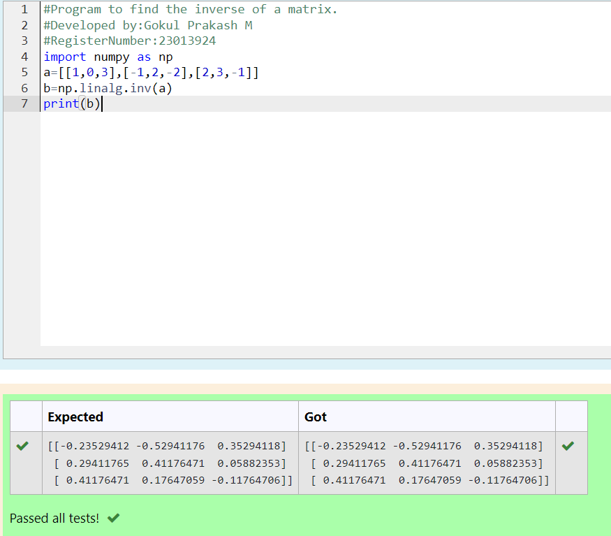

# INVERSE-OF-A-MATRIX
## Aim:
To write a python program to find the inverse of a matrix
## Equipment’s required:
1. 	Hardware – PCs
2. 	Anaconda – Python 3.7 Installation / Moodle-Code Runner
## Algorithm:
### Step1 : 
import numpy as np
### Step 2: 
assign the matrix in a
### Step 3: 
assign np.linalg.inv(a) in b
### Step 4: 
print b

## Program:
'''
#Program to find the inverse of a matrix.
#Developed by:Gokul Prakash M
#RegisterNumber:23013924
import numpy as np
a=[[1,0,3],[-1,2,-2],[2,3,-1]]
b=np.linalg.inv(a)
print(b)
'''
## Output:

## Result:
Thus the inverse of given matrix is successfully solved using python program

